# Graphify on Larger Open RTL and UVM Targets

This project now pushes past the toy-example stage.

`run_graphify.py` can stage open git repositories, sparse-check out only the interesting RTL/UVM subtrees, honor filelists, emit a deterministic manifest, and generate a reviewable structural visualization even when the Graphify CLI itself is not installed.

## What changed

- local directory or remote git repo input
- sparse checkout support for large public repositories
- optional filelist-driven source selection
- deterministic `sources.json` manifest plus `summary.json`
- Markdown graph visualization with Mermaid output
- reusable open-target presets in `configs/open_targets.json`

## Recommended open targets

| Target | Type | Repo | Paths | Files | UVM files | Entities | Edges |
| --- | --- | --- | --- | ---: | ---: | ---: | ---: |
| `ibex_rtl` | Large RTL hierarchy | `lowRISC/ibex` | `rtl` | 30 | 0 | 30 | 75 |
| `opentitan_uart_dv` | Large UVM/DV + IP RTL slice | `lowRISC/opentitan` | `hw/ip/uart`, `hw/dv/sv` | 382 | 319 | 484 | 489 |

These numbers were generated from the checked-in workflow outputs under `graph/graphify_outputs/`.

## Example commands

### 1) Local UVM example with filelist ordering

```bash
python3 scripts/run_graphify.py \
  examples/uvm_tb \
  --filelist files.f \
  --output-dir graph/graphify_outputs/uvm_example \
  --manifest-only
```

### 2) Larger open RTL target, Ibex

```bash
python3 scripts/run_graphify.py \
  https://github.com/lowRISC/ibex.git \
  --repo-ref master \
  --sparse-path rtl \
  --output-dir graph/graphify_outputs/ibex_rtl \
  --manifest-only
```

### 3) Larger open UVM target, OpenTitan UART DV slice

```bash
python3 scripts/run_graphify.py \
  https://github.com/lowRISC/opentitan.git \
  --repo-ref master \
  --sparse-path hw/ip/uart \
  --sparse-path hw/dv/sv \
  --output-dir graph/graphify_outputs/opentitan_uart_dv \
  --manifest-only
```

## Readable visualization example

The small UVM example stays the best human-readable demo, so the Markdown below is what we want in docs and reviews.

```mermaid
graph TD
    counter_item["counter_item"] -->|extends| uvm_sequence_item["uvm_sequence_item"]
    counter_sequence["counter_sequence"] -->|extends| uvm_sequence["uvm_sequence"]
    counter_driver["counter_driver"] -->|extends| uvm_driver["uvm_driver"]
    counter_monitor["counter_monitor"] -->|extends| uvm_component["uvm_component"]
    counter_scoreboard["counter_scoreboard"] -->|extends| uvm_subscriber["uvm_subscriber"]
    counter_agent["counter_agent"] -->|extends| uvm_component
    counter_env["counter_env"] -->|extends| uvm_component
    counter_test["counter_test"] -->|extends| uvm_test["uvm_test"]
    tb_counter_pkg_sv["tb_counter_pkg.sv"] -->|imports| uvm_pkg___["uvm_pkg::*"]
    tb_counter_uvm_sv["tb_counter_uvm.sv"] -->|instantiates| counter_if["counter_if"]
    tb_counter_uvm_sv -->|instantiates| counter["counter"]
    tb_counter_uvm_sv -->|imports| uvm_pkg___
    tb_counter_uvm_sv -->|imports| tb_counter_pkg___["tb_counter_pkg::*"]
```



## What the larger targets prove

### Ibex RTL

The Ibex run shows the workflow can recover a non-trivial module hierarchy and import structure from a public core-sized RTL codebase. The visualization surfaces the expected spine quickly:

- `ibex_top` instantiates `ibex_core`
- `ibex_core` fans into IF/ID/EX/LSU/WB stage modules
- package import fan-in is visible across the RTL set

### OpenTitan UART DV

The OpenTitan run proves the workflow scales into a much larger UVM-oriented codebase. Even the heuristic summary already recovers meaningful verification structure:

- hundreds of UVM classes and packages
- heavy reuse of `dv_base_*` infrastructure
- agent / sequencer / driver / monitor inheritance chains
- UART IP-local DV environment alongside shared corporate-style DV libraries

That makes the output immediately useful for:

- onboarding into unfamiliar DV environments
- spotting where common infrastructure dominates the graph
- selecting which subgraphs deserve full Graphify export and deeper querying

## Output files

Each run emits:

```text
graph/graphify_outputs/<target>/
├── sources.json
├── summary.json
└── graph.md
```

If Graphify is installed, the same run can also emit the tool's richer native graph outputs into the same directory.

## Caveats

The built-in summary is heuristic, not a parser replacement.

That is intentional. It gives us a deterministic fallback artifact that is easy to diff, easy to review in Markdown, and good enough to triage which open RTL/UVM targets deserve deeper Graphify work next.
