# Graphify Structural Visualization

Manifest: `sources.json`

## Snapshot

- Files: 30
- UVM-related files: 0
- Entities: 30
- Heuristic edges: 75

## Mermaid overview

```mermaid
graph TD
    rtl_ibex_alu_sv["rtl/ibex_alu.sv"]
    ibex_pkg___["ibex_pkg::*"]
    rtl_ibex_alu_sv -->|imports| ibex_pkg___
    rtl_ibex_branch_predict_sv["rtl/ibex_branch_predict.sv"]
    rtl_ibex_branch_predict_sv -->|imports| ibex_pkg___
    rtl_ibex_compressed_decoder_sv["rtl/ibex_compressed_decoder.sv"]
    rtl_ibex_compressed_decoder_sv -->|imports| ibex_pkg___
    rtl_ibex_controller_sv["rtl/ibex_controller.sv"]
    rtl_ibex_controller_sv -->|imports| ibex_pkg___
    rtl_ibex_core_sv["rtl/ibex_core.sv"]
    prim_buf["prim_buf"]
    rtl_ibex_core_sv -->|instantiates| prim_buf
    ibex_if_stage["ibex_if_stage"]
    rtl_ibex_core_sv -->|instantiates| ibex_if_stage
    ibex_id_stage["ibex_id_stage"]
    rtl_ibex_core_sv -->|instantiates| ibex_id_stage
    ibex_ex_block["ibex_ex_block"]
    rtl_ibex_core_sv -->|instantiates| ibex_ex_block
    ibex_load_store_unit["ibex_load_store_unit"]
    rtl_ibex_core_sv -->|instantiates| ibex_load_store_unit
    ibex_wb_stage["ibex_wb_stage"]
    rtl_ibex_core_sv -->|instantiates| ibex_wb_stage
    prim_secded_inv_39_32_enc["prim_secded_inv_39_32_enc"]
    rtl_ibex_core_sv -->|instantiates| prim_secded_inv_39_32_enc
    prim_secded_inv_39_32_dec["prim_secded_inv_39_32_dec"]
    rtl_ibex_core_sv -->|instantiates| prim_secded_inv_39_32_dec
    ibex_cs_registers["ibex_cs_registers"]
    rtl_ibex_core_sv -->|instantiates| ibex_cs_registers
    ibex_pmp["ibex_pmp"]
    rtl_ibex_core_sv -->|instantiates| ibex_pmp
    rtl_ibex_core_sv -->|imports| ibex_pkg___
    rtl_ibex_cs_registers_sv["rtl/ibex_cs_registers.sv"]
    ibex_csr["ibex_csr"]
    rtl_ibex_cs_registers_sv -->|instantiates| ibex_csr
    ibex_counter["ibex_counter"]
    rtl_ibex_cs_registers_sv -->|instantiates| ibex_counter
    rtl_ibex_cs_registers_sv -->|imports| ibex_pkg___
    rtl_ibex_decoder_sv["rtl/ibex_decoder.sv"]
    rtl_ibex_decoder_sv -->|imports| ibex_pkg___
    rtl_ibex_dummy_instr_sv["rtl/ibex_dummy_instr.sv"]
    rtl_ibex_dummy_instr_sv -->|imports| ibex_pkg___
    rtl_ibex_ex_block_sv["rtl/ibex_ex_block.sv"]
    ibex_alu["ibex_alu"]
    rtl_ibex_ex_block_sv -->|instantiates| ibex_alu
    rtl_ibex_ex_block_sv -->|imports| ibex_pkg___
    rtl_ibex_icache_sv["rtl/ibex_icache.sv"]
    prim_secded_inv_28_22_enc["prim_secded_inv_28_22_enc"]
    rtl_ibex_icache_sv -->|instantiates| prim_secded_inv_28_22_enc
    rtl_ibex_icache_sv -->|instantiates| prim_secded_inv_39_32_enc
    prim_secded_inv_28_22_dec["prim_secded_inv_28_22_dec"]
    rtl_ibex_icache_sv -->|instantiates| prim_secded_inv_28_22_dec
    rtl_ibex_icache_sv -->|instantiates| prim_secded_inv_39_32_dec
    rtl_ibex_icache_sv -->|imports| ibex_pkg___
    rtl_ibex_id_stage_sv["rtl/ibex_id_stage.sv"]
    ibex_decoder["ibex_decoder"]
    rtl_ibex_id_stage_sv -->|instantiates| ibex_decoder
    ibex_controller["ibex_controller"]
    rtl_ibex_id_stage_sv -->|instantiates| ibex_controller
    rtl_ibex_id_stage_sv -->|imports| ibex_pkg___
    rtl_ibex_if_stage_sv["rtl/ibex_if_stage.sv"]
    rtl_ibex_if_stage_sv -->|instantiates| prim_buf
    rtl_ibex_if_stage_sv -->|instantiates| prim_secded_inv_39_32_dec
    ibex_icache["ibex_icache"]
    rtl_ibex_if_stage_sv -->|instantiates| ibex_icache
    ibex_prefetch_buffer["ibex_prefetch_buffer"]
    rtl_ibex_if_stage_sv -->|instantiates| ibex_prefetch_buffer
    ibex_compressed_decoder["ibex_compressed_decoder"]
    rtl_ibex_if_stage_sv -->|instantiates| ibex_compressed_decoder
    ibex_dummy_instr["ibex_dummy_instr"]
    rtl_ibex_if_stage_sv -->|instantiates| ibex_dummy_instr
    ibex_branch_predict["ibex_branch_predict"]
    rtl_ibex_if_stage_sv -->|instantiates| ibex_branch_predict
    rtl_ibex_if_stage_sv -->|imports| ibex_pkg___
    rtl_ibex_load_store_unit_sv["rtl/ibex_load_store_unit.sv"]
    rtl_ibex_load_store_unit_sv -->|instantiates| prim_secded_inv_39_32_dec
    rtl_ibex_lockstep_sv["rtl/ibex_lockstep.sv"]
    prim_count["prim_count"]
    rtl_ibex_lockstep_sv -->|instantiates| prim_count
    prim_flop["prim_flop"]
    rtl_ibex_lockstep_sv -->|instantiates| prim_flop
    prim_clock_mux2["prim_clock_mux2"]
    rtl_ibex_lockstep_sv -->|instantiates| prim_clock_mux2
    ibex_core["ibex_core"]
    rtl_ibex_lockstep_sv -->|instantiates| ibex_core
    ibex_register_file_ff["ibex_register_file_ff"]
    rtl_ibex_lockstep_sv -->|instantiates| ibex_register_file_ff
    ibex_register_file_fpga["ibex_register_file_fpga"]
    rtl_ibex_lockstep_sv -->|instantiates| ibex_register_file_fpga
    ibex_register_file_latch["ibex_register_file_latch"]
    rtl_ibex_lockstep_sv -->|instantiates| ibex_register_file_latch
    rtl_ibex_lockstep_sv -->|imports| ibex_pkg___
    rtl_ibex_multdiv_fast_sv["rtl/ibex_multdiv_fast.sv"]
    rtl_ibex_multdiv_fast_sv -->|imports| ibex_pkg___
    rtl_ibex_multdiv_slow_sv["rtl/ibex_multdiv_slow.sv"]
    rtl_ibex_multdiv_slow_sv -->|imports| ibex_pkg___
    rtl_ibex_pmp_sv["rtl/ibex_pmp.sv"]
    rtl_ibex_pmp_sv -->|imports| ibex_pkg___
    rtl_ibex_prefetch_buffer_sv["rtl/ibex_prefetch_buffer.sv"]
    ibex_fetch_fifo["ibex_fetch_fifo"]
    rtl_ibex_prefetch_buffer_sv -->|instantiates| ibex_fetch_fifo
    rtl_ibex_top_sv["rtl/ibex_top.sv"]
    rtl_ibex_top_sv -->|instantiates| prim_flop
    prim_clock_gating["prim_clock_gating"]
    rtl_ibex_top_sv -->|instantiates| prim_clock_gating
    rtl_ibex_top_sv -->|instantiates| prim_buf
    rtl_ibex_top_sv -->|instantiates| ibex_core
    rtl_ibex_top_sv -->|instantiates| ibex_register_file_ff
    rtl_ibex_top_sv -->|instantiates| ibex_register_file_fpga
    rtl_ibex_top_sv -->|instantiates| ibex_register_file_latch
    prim_ram_1p_scr["prim_ram_1p_scr"]
    rtl_ibex_top_sv -->|instantiates| prim_ram_1p_scr
    prim_ram_1p["prim_ram_1p"]
    rtl_ibex_top_sv -->|instantiates| prim_ram_1p
    ibex_lockstep["ibex_lockstep"]
    rtl_ibex_top_sv -->|instantiates| ibex_lockstep
    rtl_ibex_top_sv -->|instantiates| prim_secded_inv_39_32_dec
    rtl_ibex_top_sv -->|imports| ibex_pkg___
    rtl_ibex_top_tracing_sv["rtl/ibex_top_tracing.sv"]
    rtl_ibex_top_tracing_sv -->|imports| ibex_pkg___
    rtl_ibex_tracer_pkg_sv["rtl/ibex_tracer_pkg.sv"]
    rtl_ibex_tracer_pkg_sv -->|imports| ibex_pkg___
    rtl_ibex_wb_stage_sv["rtl/ibex_wb_stage.sv"]
    rtl_ibex_wb_stage_sv -->|imports| ibex_pkg___
```

## Largest files

| File | Lines | UVM | run_test | config_db | analysis_port |
| --- | ---: | :---: | :---: | :---: | :---: |
| `rtl/ibex_core.sv` | 2023 | N | N | N | N |
| `rtl/ibex_cs_registers.sv` | 1682 | N | N | N | N |
| `rtl/ibex_alu.sv` | 1400 | N | N | N | N |
| `rtl/ibex_top.sv` | 1394 | N | N | N | N |
| `rtl/ibex_icache.sv` | 1337 | N | N | N | N |
| `rtl/ibex_decoder.sv` | 1212 | N | N | N | N |
| `rtl/ibex_tracer.sv` | 1208 | N | N | N | N |
| `rtl/ibex_id_stage.sv` | 1156 | N | N | N | N |
| `rtl/ibex_controller.sv` | 944 | N | N | N | N |
| `rtl/ibex_compressed_decoder.sv` | 847 | N | N | N | N |

## Notes

- This view is derived from deterministic source scanning, so it remains available even without a Graphify install.
- Use it as a reviewable baseline, then compare against richer Graphify graph exports when available.
