# Graphify Structural Visualization

Manifest: `sources.json`

## Snapshot

- Files: 4
- UVM-related files: 2
- Entities: 12
- Heuristic edges: 13

## Mermaid overview

```mermaid
graph TD
    counter_item["counter_item"]
    uvm_sequence_item["uvm_sequence_item"]
    counter_item -->|extends| uvm_sequence_item
    counter_sequence["counter_sequence"]
    uvm_sequence["uvm_sequence"]
    counter_sequence -->|extends| uvm_sequence
    counter_driver["counter_driver"]
    uvm_driver["uvm_driver"]
    counter_driver -->|extends| uvm_driver
    counter_monitor["counter_monitor"]
    uvm_component["uvm_component"]
    counter_monitor -->|extends| uvm_component
    counter_scoreboard["counter_scoreboard"]
    uvm_subscriber["uvm_subscriber"]
    counter_scoreboard -->|extends| uvm_subscriber
    counter_agent["counter_agent"]
    counter_agent -->|extends| uvm_component
    counter_env["counter_env"]
    counter_env -->|extends| uvm_component
    counter_test["counter_test"]
    uvm_test["uvm_test"]
    counter_test -->|extends| uvm_test
    tb_counter_pkg_sv["tb_counter_pkg.sv"]
    uvm_pkg___["uvm_pkg::*"]
    tb_counter_pkg_sv -->|imports| uvm_pkg___
    tb_counter_uvm_sv["tb_counter_uvm.sv"]
    counter_if["counter_if"]
    tb_counter_uvm_sv -->|instantiates| counter_if
    counter["counter"]
    tb_counter_uvm_sv -->|instantiates| counter
    tb_counter_uvm_sv -->|imports| uvm_pkg___
    tb_counter_pkg___["tb_counter_pkg::*"]
    tb_counter_uvm_sv -->|imports| tb_counter_pkg___
```

## Largest files

| File | Lines | UVM | run_test | config_db | analysis_port |
| --- | ---: | :---: | :---: | :---: | :---: |
| `tb_counter_pkg.sv` | 207 | Y | N | Y | Y |
| `tb_counter_uvm.sv` | 31 | Y | Y | Y | N |
| `/home/kyungpyo/ws/varuna/project/open-rtl-verification/examples/rtl/counter.sv` | 30 | N | N | N | N |
| `counter_if.sv` | 6 | N | N | N | N |

## Notes

- This view is derived from deterministic source scanning, so it remains available even without a Graphify install.
- Use it as a reviewable baseline, then compare against richer Graphify graph exports when available.
